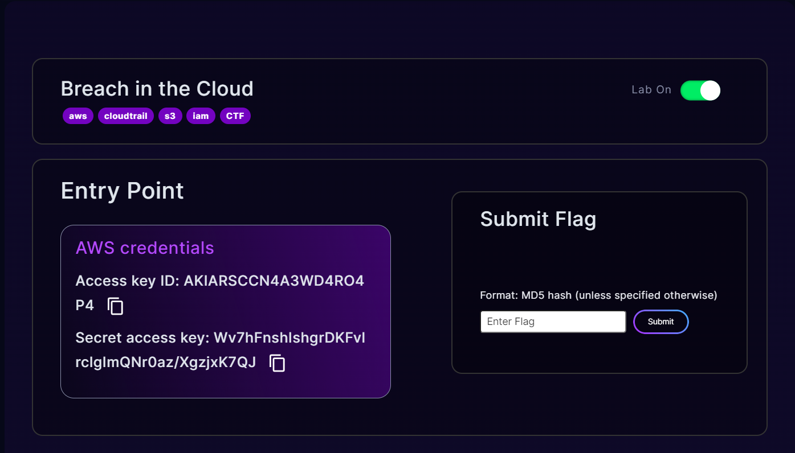
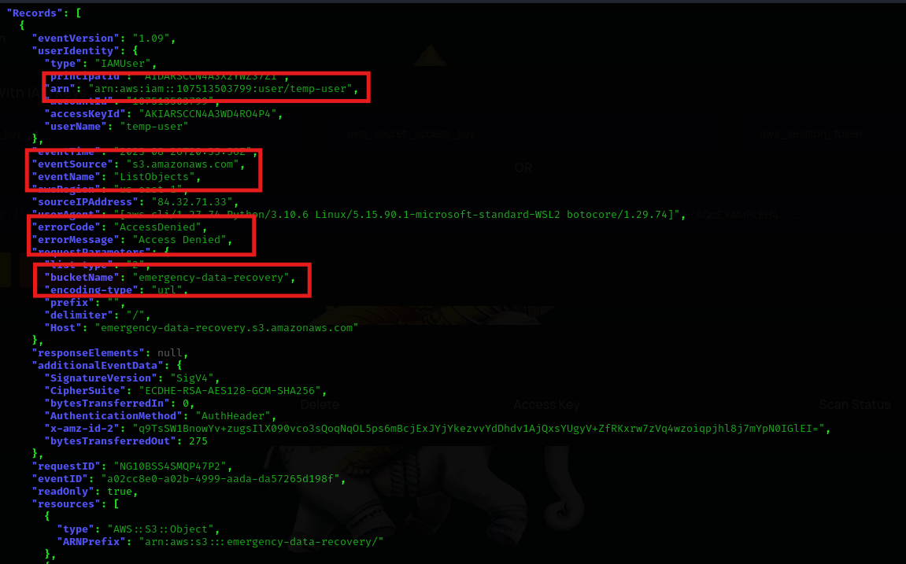
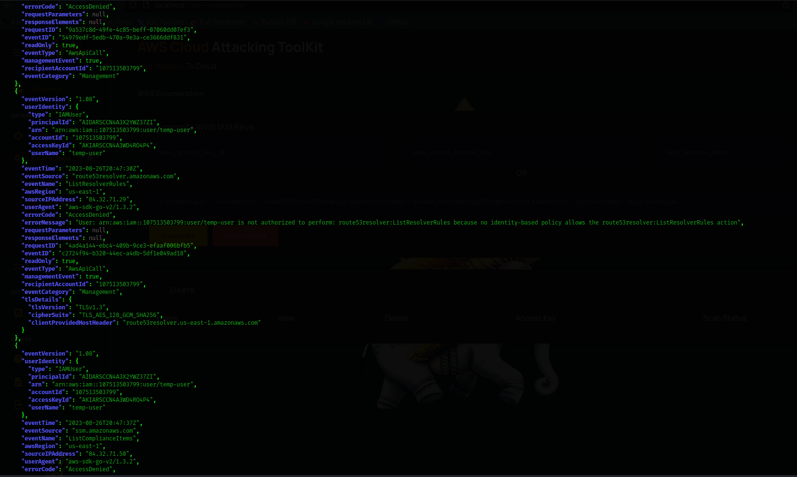
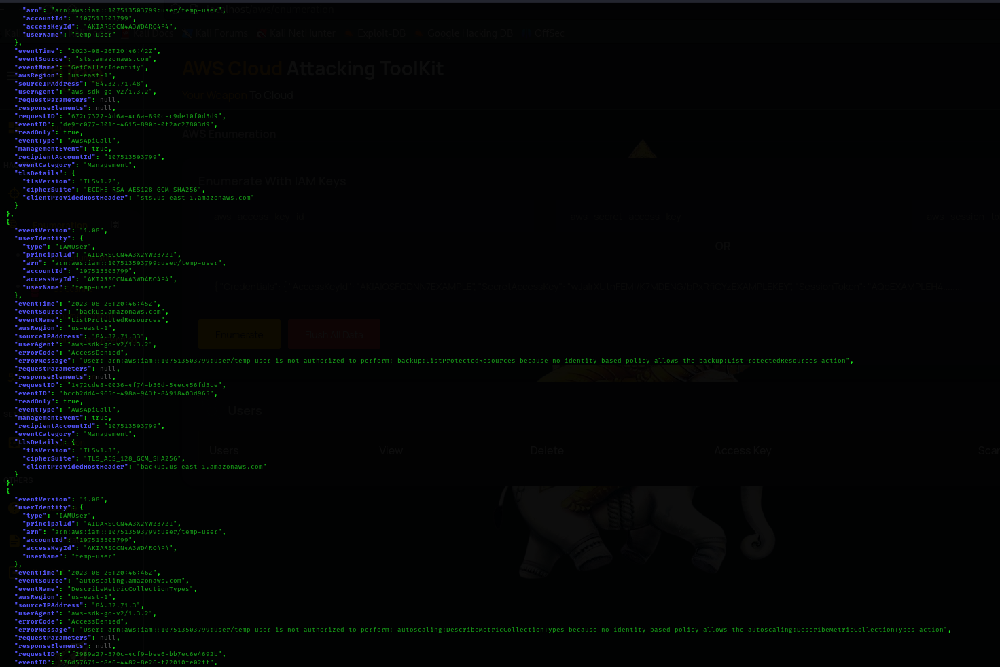
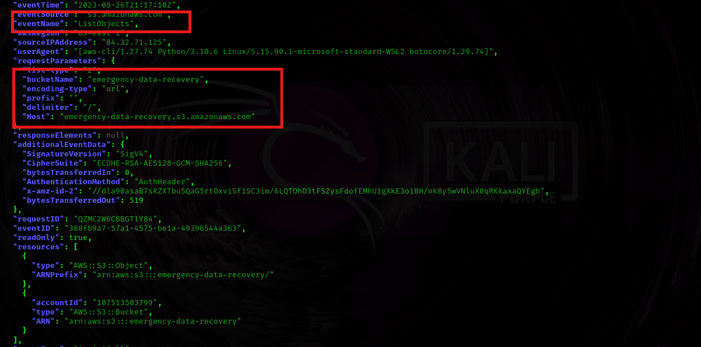
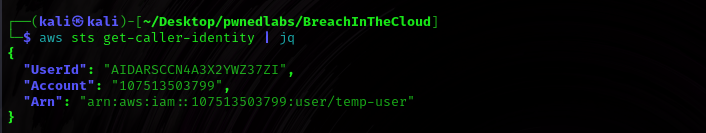
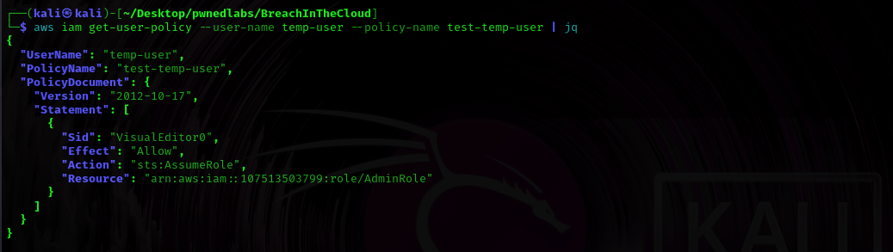
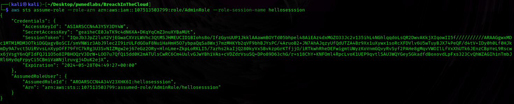
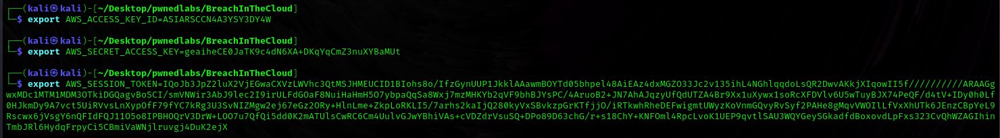
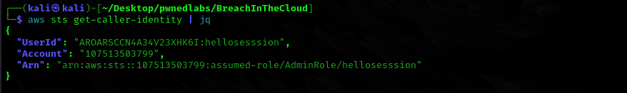

# Breach In The Cloud Writeup
This Challenge gives us a scenario where we have been alerted to a potential security threat. The Huge Logistics security team have provided you with AWS keys of an account that saw unusual activity, as well as AWS CloudTrail logs around the time of the activity. We need your expertise to confirm the breach by analyzing our CloudTrail logs, identifying the compromised AWS service and any data that was exfiltrated.

AWS CloudTrail is a service that enables governance, compliance, operational auditing, and risk auditing of AWS account.

<hr/>

Lets' Start with the Challenge.

We have been given the following AWS Credentials at the start.
<figure></figure>

Let's Configure our `aws-cli` using these credentials.

```
┌──(kali㉿kali)-[~/Desktop/pwnedlabs/BreachInTheCloud]
└─$ aws sts get-caller-identity | jq
{
  "UserId": "AIDARSCCN4A3X2YWZ37ZI",
  "Account": "107513503799",
  "Arn": "arn:aws:iam::107513503799:user/temp-user"
}
```

I downloaded the log files from the discord server and unzipped them to get the following files.

```terminal
┌──(kali㉿kali)-[~/Desktop/pwnedlabs/BreachInTheCloud]
└─$ ls    
107513503799_CloudTrail_us-east-1_20230826T2035Z_PjmwM7E4hZ6897Aq.json  107513503799_CloudTrail_us-east-1_20230826T2100Z_APB7fBUnHmiWjHtg.json
107513503799_CloudTrail_us-east-1_20230826T2040Z_UkDeakooXR09uCBm.json  107513503799_CloudTrail_us-east-1_20230826T2105Z_fpp78PgremAcrW5c.json
107513503799_CloudTrail_us-east-1_20230826T2050Z_iUtQqYPskB20yZqT.json  107513503799_CloudTrail_us-east-1_20230826T2120Z_UCUhsJa0zoFY3ZO0.json
107513503799_CloudTrail_us-east-1_20230826T2055Z_W0F5uypAbGttUgSn.json
```

Let's breakdown the file format to understand the data.

```text
107513503799_CloudTrail_us-east-1_20230826T2035Z_PjmwM7E4hZ6897Aq.json

107513503799 => Account ID
CloudTrail => Service Name
us-east-1 => Region
20230826T2035Z => Timestamp
PjmwM7E4hZ6897Aq => Random Identifier
```

## File 1

On analyzing the first file `107513503799_CloudTrail_us-east-1_20230826T2035Z_PjmwM7E4hZ6897Aq.json`, all the activities we're realated to root only one of them was for the following `temp-user` to which we have access.

```json
{
      "eventVersion": "1.08",
      "userIdentity": {
        "type": "IAMUser",
        "principalId": "AIDARSCCN4A3X2YWZ37ZI",
        "arn": "arn:aws:iam::107513503799:user/temp-user",
        "accountId": "107513503799",
        "userName": "temp-user"
      },
      "eventTime": "2023-08-26T20:29:37Z",
      "eventSource": "sts.amazonaws.com",
      "eventName": "GetCallerIdentity",
      "awsRegion": "us-east-1",
      "sourceIPAddress": "84.32.71.19",
      "userAgent": "aws-cli/1.27.74 Python/3.10.6 Linux/5.15.90.1-microsoft-standard-WSL2 botocore/1.29.74",
      "requestParameters": null,
      "responseElements": null,
      "requestID": "3db296ab-c531-4b4a-a468-e1b05ec83246",
      "eventID": "ea6ae4b8-aae8-4fca-a495-2df427bdce46",
      "readOnly": true,
      "eventType": "AwsApiCall",
      "managementEvent": true,
      "recipientAccountId": "107513503799",
      "eventCategory": "Management",
      "tlsDetails": {
        "tlsVersion": "TLSv1.2",
        "cipherSuite": "ECDHE-RSA-AES128-GCM-SHA256",
        "clientProvidedHostHeader": "sts.amazonaws.com"
      }
    }
```

It just calls the `GetCallerIdentity` API.

## File 2
  
In the next file `107513503799_CloudTrail_us-east-1_20230826T2040Z_UkDeakooXR09uCBm.json` the `temp-user` tried to list objects inside the `emergency-data-recovery` s3 bucket and recieved an access denied error.

<figure></figure>

## File 3

The third file `107513503799_CloudTrail_us-east-1_20230826T2050Z_iUtQqYPskB20yZqT.json` was a bunch of error messages made by the temp-user and recieved `Access-Denied`

<figure></figure>

## File 4

The fourth file `107513503799_CloudTrail_us-east-1_20230826T2055Z_W0F5uypAbGttUgSn.json` is also a bunch of error messages.

<figure></figure>

## File 5

In the fifth file `107513503799_CloudTrail_us-east-1_20230826T2100Z_APB7fBUnHmiWjHtg.json`, We can see that the `temp-user` called the `Assume Role` API to which he was able to have access to `AdminRole` role for a limited duration.

## File 6

In the last file `107513503799_CloudTrail_us-east-1_20230826T2120Z_UCUhsJa0zoFY3ZO0.json`, We can see that the `AdminRole` user is able to make the API calls of `ListObject` and `GetObject`.

<figure></figure>

After analyzing the log files, Let's try to retrace the steps and get access.

## Retracing The Steps

I configured the `aws-cli` as per the credentials given in the starting point of the lab to have access as the `temp-user`.

```bash
$ aws sts get-caller-identity
```

<figure></figure>

Now let's check what policies are attached as a temp-user.

```bash
$ aws iam list-user-policies --user-name temp-user
```

<figure></figure>

Let's check the policy to see the actions we are able to make as a temp-user.

```bash
$ aws iam get-user-policy --user-name temp-user --policy-name test-temp-user
```

<figure></figure>

## Assuming the Role

```bash
$ aws sts assume-role --role-arn arn:aws:iam::107513503799:role/AdminRole --role-session-name hellosesssion
```

<figure></figure>

Exported the values as environment variables to login into the AdminRole.

<figure><figure>

Let's run `get-caller-identity` to check our role again.

```bash
$ aws sts get-caller-identity
```

<figure></figure>

