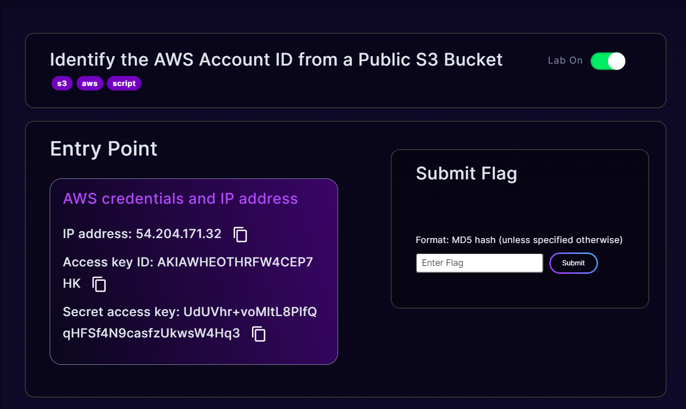
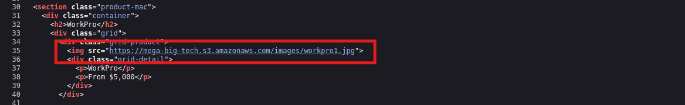
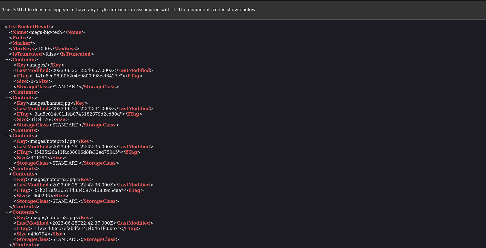
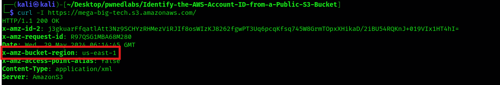
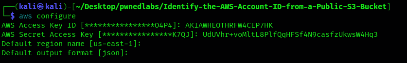
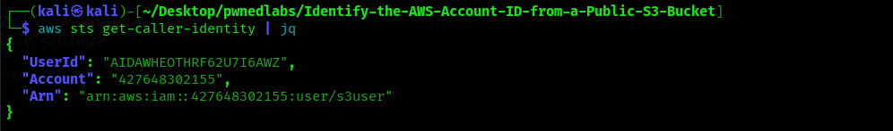
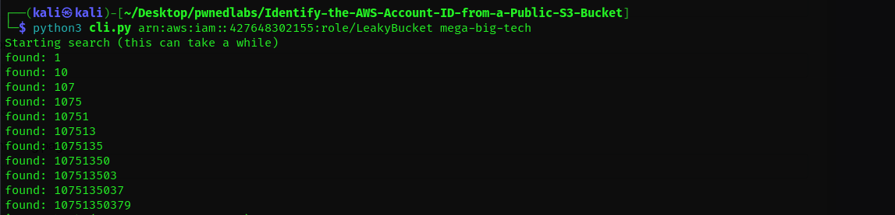
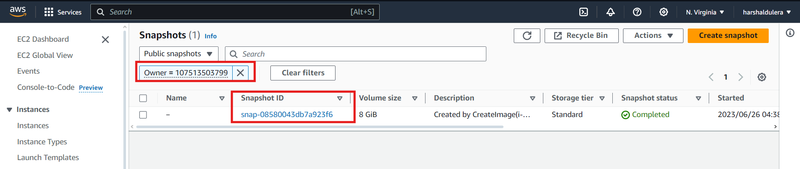

# Identify The AWS Account ID from a Public S3 Bucket Writeup
This challenge gives us a scenario where a global logistics company has tasked our cybersecurity firm with identifying their AWS account ID through a public S3 bucket, starting with the IP address of their website. The goal is to demonstrate how even minor oversights can be exploited, emphasizing the significance of robust security practices. By leveraging detailed error messages from AWS services, we aim to compile a list of possible IAM users and roles, ultimately finding the AWS account ID. This exercise requires basic Linux command line knowledge and offers valuable insights into techniques for discovering AWS account IDs and understanding tool functionalities through code review.

<hr/>

Let's start with the challenge.

We have been given the following information about the entrypoint in the start.
<figure></figure>

## Enumeration
Let's start by scanning the IP Address with Nmap.

```
┌──(kali㉿kali)-[~/Desktop/pwnedlabs]
└─$ nmap -sC -sV -vv 54.204.171.32
PORT   STATE SERVICE REASON  VERSION
80/tcp open  http    syn-ack Apache httpd 2.4.52 ((Ubuntu))
| http-methods: 
|_  Supported Methods: POST OPTIONS HEAD GET
|_http-title: Mega Big Tech
|_http-server-header: Apache/2.4.52 (Ubuntu)
```

This reveals the website for Mega Big Tech. 
<figure></figure>

On inspecting the source code, It reveals that the images are being hosted on a s3 bucket named `mega-big-tech`.
<figure></figure>

On inspecting the bucket, it only reveals a folder of images.
<figure></figure>

Let's find the region of the bucket then try to login with `aws-cli`.
<figure></figure>

I Logged in with `aws-cli` using the credentials in entrypoint.
<figure></figure>

Using the `get-caller-identity` to check the user.

```bash
$ aws sts get-caller-identity | jq
```

<figure></figure>

It's given in the page that the IAM credentials we need are `arn:aws:iam::427648302155:role/LeakyBucket`.
We will use the tool [s3-account-search](https://github.com/WeAreCloudar/s3-account-search/blob/main/s3_account_search/cli.py) which bruteforces the Account ID of the Public S3 Bucket.

<figure></figure>

Once we've got the account ID we can search for public listed snapshots by the Account ID `107513503799`.
<figure></figure>

It's mentioned that the flag is the Account ID which is `107513503799`.

Hence we have completed the lab.

Thank you!! Happy Hacking :D