# Intro to AWS IAM Enumeration Writeup
This writeup details the process of enumerating AWS IAM (Identity and Access Management) entities and their policies. The enumeration involves listing attached and inline policies, inspecting specific policy versions, and exploring roles like BackendDev. The process culminates in discovering an S3 bucket named hl-dev-artifacts and identifying a flag.txt file within, indicating successful completion of the challenge. The writeup serves as a guide for methodically uncovering and understanding IAM configurations in AWS.

<hr/>

Let's start with the challenge.

We have been given the following information about the entry point in the start.
<figure>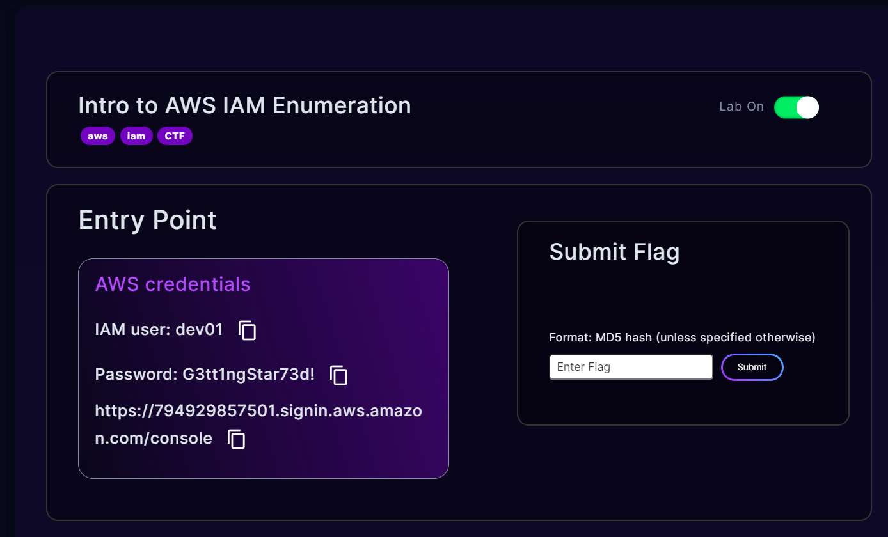</figure>

The subdomain in the link is the Account ID `794929857501`.
<figure>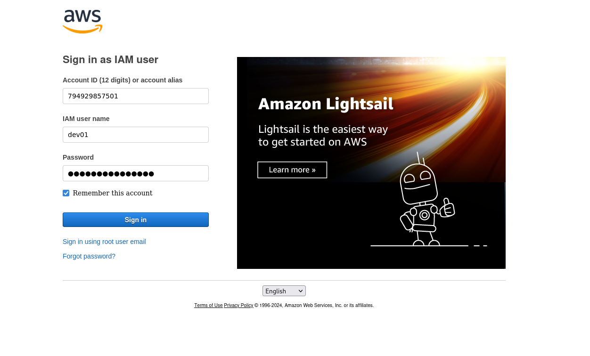</figure>

I configured my `aws-cli` according to the given credentials.
```sh
$ aws sts get-caller-identity | jq
```

<figure>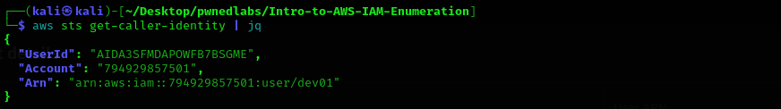</figure>

Let's get more information about the user.
```sh
$ aws iam get-user | jq
```

<figure>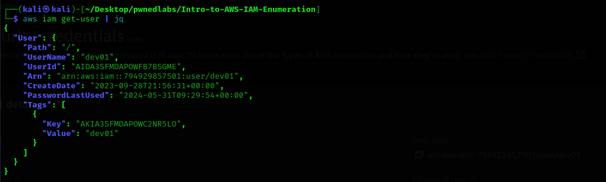</figure>

We can list the attached policies of the user.
```sh
$ aws iam list-attached-user-policies --user-name dev01 | jq
```
<figure>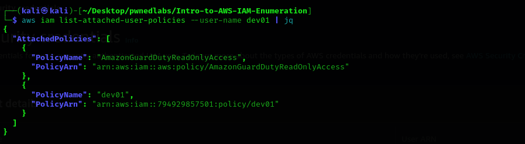</figure>

Let's check the inline policies of dev01.
```sh
$ aws iam list-user-policies --user-name dev01 | jq
```

<figure>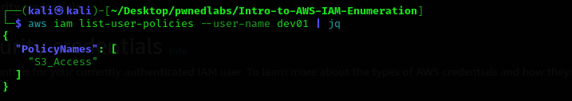</figure>

Let's dig into policies now, Let's list the versions of the `AmazonGuardDutyReadOnlyAccess` policy.
```sh
$ aws iam list-policy-versions --policy-arn arn:aws:iam::aws:policy/AmazonGuardDutyReadOnlyAccess | jq
```

<figure>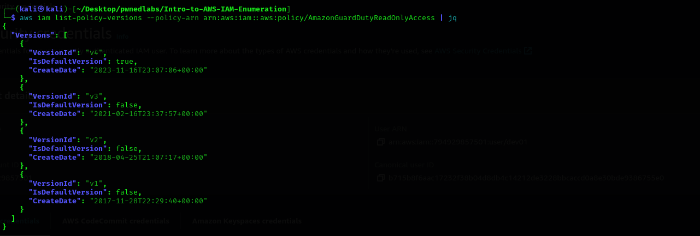</figure>

The latest version is `v3`. Let's run a command to check the details about it.
```sh
$ aws iam get-policy-version --policy-arn arn:aws:iam::aws:policy/AmazonGuardDutyReadOnlyAccess --version-id v3 | jq
```

<figure>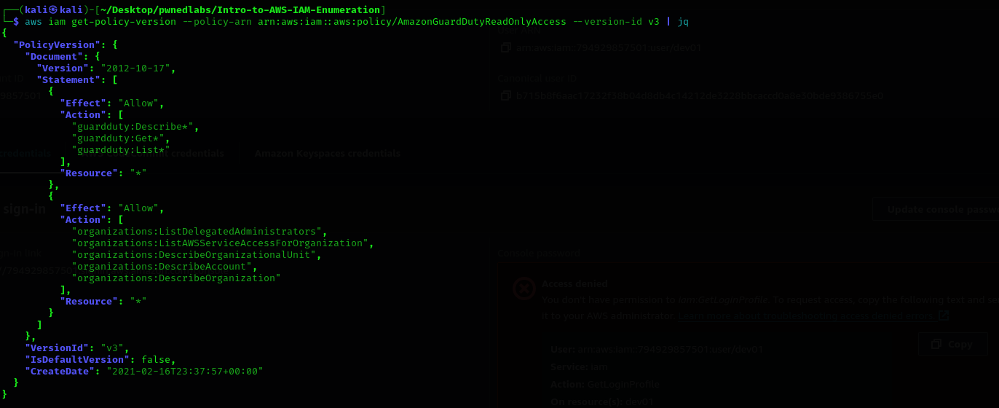</figure>

Let's check the versions of the `dev01` policy.

```sh
$ aws iam list-policy-versions --policy-arn arn:aws:iam::794929857501:policy/dev01 | jq
```

<figure></figure>

The latest version for the `dev01` policy is `v7` so let's get some details for the same.

```sh
$ aws iam get-policy-version --policy-arn arn:aws:iam::794929857501:policy/dev01 --version-id v7 | jq 
```

<figure>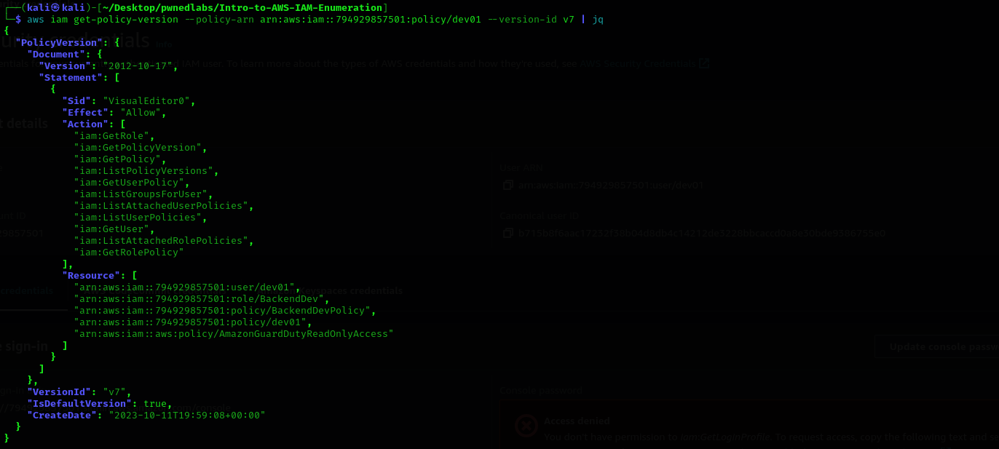</figure>

The only interesting user and policy is the `BackendDev` so let's enumerate further on it.

Let's call the `get-role` API to check details about `BackendDev`.
```sh
$ aws iam get-role --role-name BackendDev | jq
```
<figure>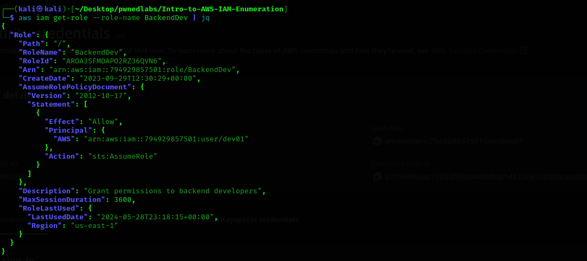</figure>

Now, let's check the attached role policies for `BackendDev`.

```sh
$ aws iam list-attached-role-policies --role-name BackendDev | jq
```

<figure>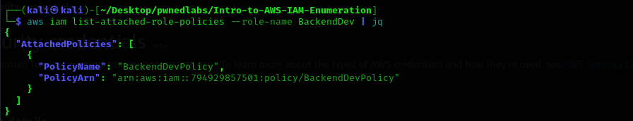</figure>

Finally, Let's examine the inline user policy `s3_access`.

```sh
$ aws iam get-user-policy --user-name dev01 --policy-name S3_Access | jq
```

<figure>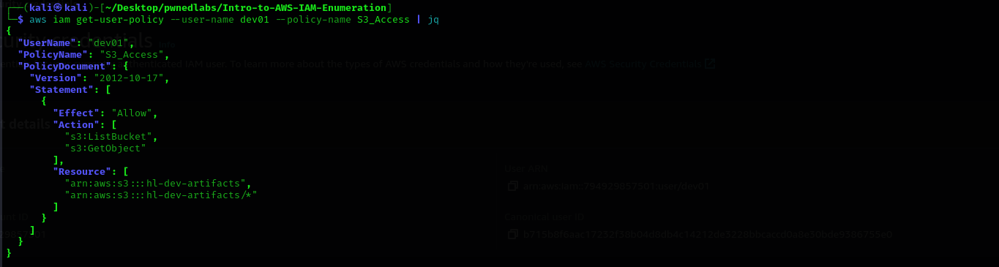</figure>

We can see that there is an s3 bucket present with the name `hl-dev-artifacts`. Let's list the contents of the s3 bucket.

```sh
$ aws s3 ls s3://hl-dev-artifacts
```

<figure>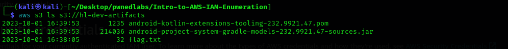</figure>

We can see there is a `flag.txt` so the lab has been pwned.

Thank you!! Happy Hacking :D